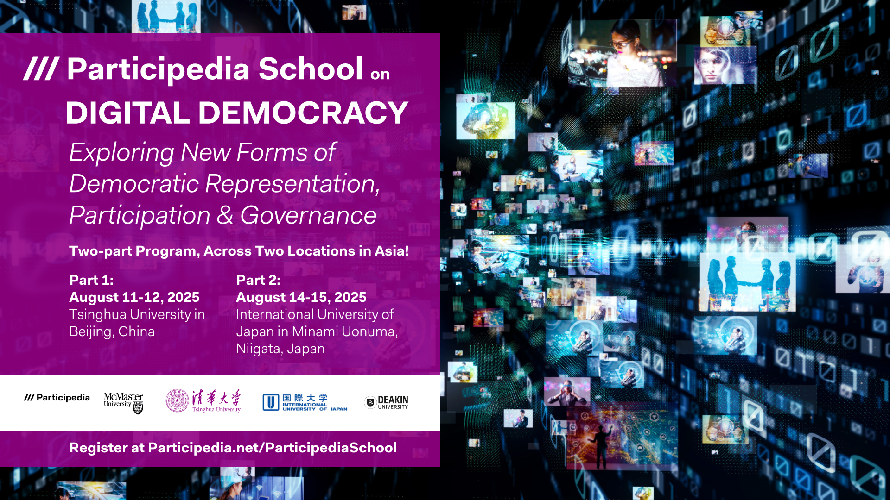

<!--  -->

<!-- # **Talks** -->

[
Digital Democracy: Exploring New Forms of Democratic Representation, Participation, and Governance
](https://participedia.net/participediaschool)
<!-- 
 -->

We are thrilled to co-host the Participedia Summer School at Tsinghua with the International University of Japan, August 11–15, 2025! Join us for an inspiring week spanning Beijing and Niigata—don’t miss out on this unique global learning experience!

Participedia Schools are intersectional, interdisciplinary, and international, democratic education spaces co-created by the Participedia community for students, practitioners, educators, government, and global civil society. Each Participedia School explores democratic innovations in a unique way, with new partners, in cities around the world.

<!-- August 11-15, 2025 | Tsinghua University in Beijing, China and the International University of Japan in Minami Uonuma, Niigata, Japan

Participedia School 2025 Rio - China
Intelligent and digital technologies have emerged as a major force in reshaping democratic institutions and public governance worldwide. Currently, over ten cities are piloting digital local democracy or participatory initiatives across China. To understand these innovative practices, examine emerging issues and tensions in the development of public digital infrastructures, and identify areas of improvement, we are pleased to announce Participedia School on Digital Democracy: Exploring New Forms of Democratic Representation, Participation, and Governance (August 11-15, 2025). The Participedia School program will span over 40 hours across 4 days, and two countries (China and Japan).

Participedia School 2025 on Digital Democracy aims to:
1. Empower the Next Generation of Researchers: Offer aspiring scholars and practitioners in digital democracy an immersive experience, engaging with the latest innovations, research, and real-world applications in the field.
2. Explore Emerging Challenges and Opportunities: Examine key issues arising from recent digital democracy initiatives, such as creating E-forums to foster greater public participation and enhance the quality of deliberative processes. The program also delves into how digital tools can expand and reimagine traditional electoral representation frameworks.
3. Foster Innovation and Collaboration: Identify critical gaps and opportunities for collaboration in addressing pressing challenges, including combating digital fraud, ensuring equitable access, and enhancing trust and transparency in democratic systems.

### Week Overview
What: This Participedia School will explore digital democracy through themes of AI and democracy, digital participation, digital deliberative democracy, algorithms in democratic oversight, public digital infrastructure, democratic integrity, and technological safeguards against digital fraud. It will span over 40 hours across 4 classroom days. The curriculum will also encourage students to utilize Participedia’s case repository.

When: August 11-15, 2025

Where:
August 11-12, 2025: Tsinghua University in Beijing, China
August 3, 2025: Travel
August 14-15, 2025: International University of Japan in Minami Uonuma, Niigata, Japan
Who: Graduate students, faculty, community leaders, local government officials, Participedia researchers, and professionals whose work can be enhanced by deepening understanding and engagement with digital democracy. The program aims to host 80 in-person participants, with additional attendees joining online. In addition to regional based registrants, we have space for up to 20 self-funded international participants.

Fee Schedule:
$300 USD to be paid by March 2025

[Registration](https://participedia.net/participediaschool). -->

<!-- {}
Click on the **Slides** button above to view the built-in slides feature.
{}

Slides can be added in a few ways:

- **Create** slides using Hugo Blox Builder's [_Slides_](https://docs.hugoblox.com/reference/content-types/) feature and link using `slides` parameter in the front matter of the talk file
- **Upload** an existing slide deck to `static/` and link using `url_slides` parameter in the front matter of the talk file
- **Embed** your slides (e.g. Google Slides) or presentation video on this page using [shortcodes](https://docs.hugoblox.com/reference/markdown/).

Further event details, including [page elements](https://docs.hugoblox.com/reference/markdown/) such as image galleries, can be added to the body of this page. -->
